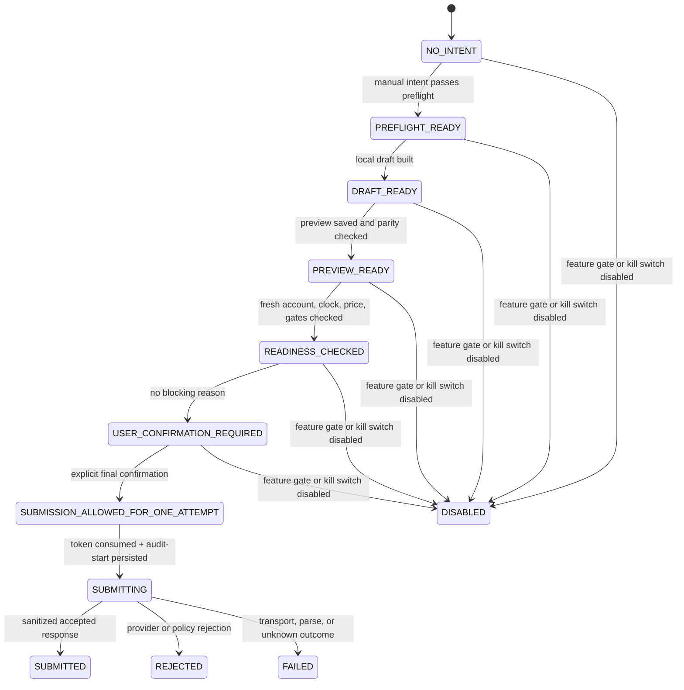

# Manual Paper execution design specification (Phase 2.t)

> **PHASE 2.v IMPLEMENTED, DEFAULT OFF.** Juan approved the narrow Paper-only, manual-only, one-shot implementation. The design remains the controlling contract: the compile-time flag and session arm default OFF, LIVE/REAL/Auto Paper remain forbidden, and no automated submission exists.

This document defines the minimum architecture, safety gates, state machine, user confirmation, audit, test, runtime-validation, and rollback requirements for a possible future manual Alpaca Paper order submission phase. It is subordinate to the [Phase 2.s safety freeze](paper-execution-safety-freeze.md) until a human explicitly approves a new implementation phase.

## A. Current state

The current build is a pre-execution lab with these properties:

- The legacy dry-run execution guard remains disabled and `PaperTradingExecutionGuard.canExecuteOrders == false`.
- REAL is locked by default and production does not call `AppState.unlockRealMode()`.
- `AlpacaHttpClient` is a read-only Paper boundary with exactly one method: `executeGet`.
- `AlpacaPaperTradingEndpoint` allows only GETs for Paper account, clock, and positions.
- A local Paper preflight engine produces `ALLOWED_DRY_RUN`, `WARNING_ONLY`, or `BLOCKED`.
- A local append-only dry-run audit exists.
- A non-executable local request draft exists.
- A theoretical payload preview and immutable review queue exist.
- A local readiness checker exists and always retains execution-disabled reasons.
- `PaperDisabledOrderExecutor` remains available and always returns `EXECUTION_DISABLED` for the disabled path.
- Phase 2.v adds a separate, default-off `AlpacaPaperOrderSubmitHttpClient` with exactly `executePostOrder`, locked to one Paper orders collection POST.
- A manual submit gate, expiring in-memory confirmation, one-shot executor, append-only audit, and compact session-armed UI exist.
- Cancellation, replacement, close-position calls, LIVE, REAL unlock, Auto Paper, background execution, and account mutation beyond the one confirmed Paper order remain absent.

The Phase 2.s freeze tests and `android/scripts/safety-scan.ps1` remain authoritative while this design is reviewed.

## B. Future goal

The possible future capability is deliberately narrow:

- Submit one manually prepared and explicitly confirmed order to an Alpaca **Paper** account.
- Accept submissions only from a foreground, user-triggered confirmation flow.
- Permit exactly one network attempt per single-use confirmation token.
- Keep Auto Paper, strategy execution, scheduling, retry automation, and background execution absent.
- Keep LIVE trading absent and reject `api.alpaca.markets` at every boundary.
- Keep REAL locked; manual Paper submission must not depend on or imply a REAL unlock.
- Permit no account mutation other than the one explicitly confirmed Paper order submission.

Juan's recorded Phase 2.v approval authorized this narrow implementation. It did not authorize automated runtime input or an unconditional Paper request.

## C. Non-goals

The first future implementation must not include:

- automatic trading or signal-to-order execution;
- strategy execution;
- scheduled, queued-for-later, background, or retrying orders;
- order cancellation unless approved as a separate later phase;
- order replacement;
- close-position endpoints;
- bracket, OCO, trailing-stop, or other compound orders unless separately scoped later;
- LIVE trading or any `api.alpaca.markets` allowlist entry;
- REAL unlock;
- foreground services;
- ML or inference;
- account-configuration mutation;
- an automatic retry after timeout, rotation, process death, or ambiguous provider response.

The initial future scope should remain the existing draft vocabulary: MARKET or LIMIT, DAY time-in-force, BUY or SELL, and a positive finite quantity. Expanding that vocabulary requires a new design review.

## D. Required future gates before allowing `POST /v2/orders`

Every gate below must pass again immediately before a network attempt. A missing, stale, unknown, or exceptional value fails closed.

| Gate | Required future behavior |
| --- | --- |
| Compile-time feature flag | A dedicated manual-Paper feature flag exists and defaults to `false` in every build type. Enabling it requires an intentional reviewed build change. |
| Runtime feature gate | A separate runtime gate defaults to disabled, is re-read immediately before submission, and fails closed if unavailable or stale. The operational kill switch overrides every other gate. |
| Compile-time guard review | The hard-false execution guard cannot merely be flipped. A reviewed replacement policy must preserve the Phase 2.s invariants for LIVE, automation, and non-submit mutations. |
| User initiation | The flow originates only from a visible manual action on the current preview. No observer, signal, timer, receiver, worker, service, startup hook, or lifecycle callback may initiate it. |
| Paper account refresh | Account/buying-power data is refreshed through the current GET-only client after entering the confirmation flow. The future policy must define and test a maximum age; the proposed baseline is 15 seconds at submission. |
| Paper clock refresh | Clock state is refreshed through the current GET-only client. The proposed baseline maximum age is 15 seconds at submission. The initial scope requires `marketOpen == true`; closed-market submission is NO-GO unless separately approved. |
| Price freshness | The final price snapshot passes the existing `MarketPriceFreshnessPolicy` as `FRESH`. A stale or missing price invalidates confirmation. |
| Preflight | Status is `ALLOWED_DRY_RUN`, or `WARNING_ONLY` with every current warning explicitly acknowledged. `BLOCKED`, unknown, or changed results reject submission. |
| Payload parity | A canonical, immutable final request matches the displayed preview field-for-field: symbol, side, type, time-in-force, quantity, and optional limit price. No hidden defaults may be introduced by the client. |
| Review queue | The exact `previewId` exists in the immutable local review queue and matches the in-memory preview. |
| Blocking reasons | The final readiness result contains no blocking reason. Any new blocking reason invalidates the token. |
| REAL lock | `realModeLocked == true` is required. `false` or unknown rejects the attempt. |
| Endpoint | The dedicated future guard permits only `https://paper-api.alpaca.markets/v2/orders`. The UI never supplies or edits the URL. |
| Method | Only POST to the exact Paper orders collection is permitted. DELETE, PATCH, PUT, cancel, replace, close-position, and account mutation remain rejected. |
| LIVE exclusion | The submit client cannot be constructed with, redirected to, or passed `api.alpaca.markets`. Redirects to a different host are rejected. |
| Credential handling | Credentials are resolved just-in-time from the existing secure provider, never enter UI/ViewModel/request/audit state, and are never logged. |
| Local audit | An append-only attempt-started record is durably written before network I/O, followed by a sanitized terminal event. If the initial audit write fails, no request is sent. |
| Single-use confirmation | A short-lived confirmation token is bound to the final snapshot and atomically consumed before network I/O. It cannot be persisted as reusable authorization. |

The proposed account/clock age and confirmation-token lifetime values are safety defaults, not provider facts. They must be explicitly accepted or changed during the future implementation review. Price age continues to use the repository's existing source-specific policy rather than a duplicated constant.

## E. Proposed future architecture

The future implementation should add a parallel mutation boundary, not widen the existing read-only boundary.

| Proposed component | Responsibility | Forbidden responsibility |
| --- | --- | --- |
| `PaperOrderSubmitClient` | One method for one already-authorized manual Paper submit attempt. Its implementation owns the fixed Paper submit endpoint and just-in-time credential use. | GET account/clock/positions, cancellation, replacement, close position, LIVE, retries, logging raw requests/responses. |
| `PaperOrderSubmitRequest` | Immutable canonical order fields plus local linkage identifiers needed for parity checks. | URL, HTTP headers, credential values, account id, mutable/defaulted fields, arbitrary JSON. |
| `PaperOrderSubmitResult` | Typed `Submitted`, `Rejected`, or `Failed` outcome with a sanitized provider summary. | Raw response body, credentials, headers, account details, an instruction to retry automatically. |
| `PaperOrderSubmitAuditEntity` | Append-only, whitelisted attempt events linked by `submitAttemptId`. | Credentials, headers, raw bodies, unmasked account id, reusable confirmation token. |
| `PaperManualSubmitViewModel` | Drives the foreground review/confirmation state and renders typed sanitized outcomes. | Direct HTTP access, credential access, endpoint selection, lifecycle-triggered submission. |
| `PaperManualSubmitExecutor` | Evaluates all gates, consumes the one-time token, writes the pre-network audit event, and invokes the submit client once. | Automatic retries, background work, cancellation/replacement, bypassing the disabled path. |
| `PaperManualSubmitEndpointGuard` | Validates exactly the method/URL pair `POST https://paper-api.alpaca.markets/v2/orders` and rejects redirects or alternate hosts/paths. | Extending the existing GET allowlist or accepting caller-configured hosts. |
| `PaperManualExecutionFeatureGate` | Combines compile-time flag, runtime flag, and emergency kill switch; defaults/fails closed. | Enabling itself from UI state or persisted confirmation state. |

### Boundary separation

- `AlpacaHttpClient` remains GET-only and unchanged.
- `AlpacaPaperTradingEndpoint` remains the read-only GET guard and unchanged.
- `PaperDisabledOrderExecutor` remains available as the default/fail-closed behavior.
- `PaperOrderSubmitClient` is a new, narrow boundary used only by `PaperManualSubmitExecutor` after all gates pass.
- Dependency injection must bind the disabled path unless both reviewed feature gates are enabled.
- Neither the submit interface nor its request accepts a URL, verb, credentials, headers, raw JSON, or callback capable of creating a second attempt.

### Request and response shape

The future request model should contain only validated typed fields:

- local linkage: `clientDryRunId`, `previewId`, `submitAttemptId`;
- order: symbol, side, quantity, order type, time-in-force, optional limit price;
- immutable parity metadata: preview version/digest and confirmation timestamp.

Only the order fields are serialized for the provider. Local linkage fields remain local unless a provider-supported idempotency field is separately verified against current official documentation and approved. The response is parsed into a whitelist; the raw response is not retained.

## F. Proposed state machine

| State | Required invariant / permitted exit |
| --- | --- |
| `NO_INTENT` | No submit-capable state exists. Only a foreground manual intent may begin the flow. |
| `PREFLIGHT_READY` | Current preflight is allowed or warning-only; any input/price/account change returns to `NO_INTENT`. |
| `DRAFT_READY` | Draft is local, immutable, and non-executable. Only preview construction is allowed. |
| `PREVIEW_READY` | Preview exists in the review queue and matches the draft. Any edit invalidates it. |
| `READINESS_CHECKED` | Account, clock, price, preflight, REAL lock, endpoint policy, and feature gates are current. Staleness returns to `PREVIEW_READY` or `NO_INTENT`. |
| `USER_CONFIRMATION_REQUIRED` | Final immutable review is visible. No network method is reachable yet. |
| `SUBMISSION_ALLOWED_FOR_ONE_ATTEMPT` | An in-memory, short-lived token is bound to the exact final snapshot. It is invalidated by timeout, lifecycle loss, navigation, field change, refresh, or kill-switch change. |
| `SUBMITTING` | Token was atomically consumed and an attempt-started audit event exists. UI is disabled against duplicate taps. Rotation/relaunch must never replay the request. |
| `SUBMITTED` | A sanitized accepted result and terminal audit event exist. No automatic follow-up mutation occurs. |
| `REJECTED` | Local policy or provider rejected the request. A terminal audit event exists; retry requires a fresh flow and confirmation. |
| `FAILED` | Transport, parse, or ambiguous result. No automatic retry. The user must verify the Paper dashboard before starting a new flow. |
| `DISABLED` | Disabled executor behavior is active. No submit client is invoked. Re-entry requires a new foreground flow after both feature gates are deliberately enabled. |

`SUBMISSION_ALLOWED_FOR_ONE_ATTEMPT` is authorization for one invocation, not a persistent mode. `SUBMITTING` is entered only after the token is consumed and the start audit is durable.

## G. Required user confirmation flow

The future UI must be a two-stage foreground flow, not a one-tap order button.

1. The user selects a current payload preview and chooses a non-executing `Review manual Paper order` action.
2. The app refreshes Paper account and clock data, refreshes price, reruns preflight, verifies the review-queue row, and checks all gates.
3. A final read-only review renders:
   - symbol;
   - BUY/SELL side;
   - quantity;
   - order type;
   - time-in-force;
   - optional limit price;
   - estimated notional;
   - buying-power impact;
   - allocation after;
   - current signal;
   - price source, freshness, age, and timestamp;
   - market open/closed state and clock timestamp;
   - every warning and its acknowledgement state;
   - exact future endpoint `https://paper-api.alpaca.markets/v2/orders`;
   - exact method `POST`;
   - an immutable preview/attempt reference suitable for support, but no credentials or account id.
4. `WARNING_ONLY` requires a separate acknowledgement for every warning. A changed warning set clears all acknowledgements.
5. The final confirmation text must state: **“This sends one order to the Alpaca Paper account. It is not a dry run.”**
6. The user must type an exact contextual phrase such as `SUBMIT PAPER SPY` after reviewing the final snapshot. Copy/paste may be disabled if accessibility review accepts that choice.
7. The final button must say `Submit one Paper order`, remain disabled until the phrase and all gates match, and show the symbol/side/quantity beside it.
8. Pressing the button creates and immediately consumes one single-use authorization. A double tap cannot create a second attempt.
9. Any input change, refresh, navigation, timeout, rotation, process recreation, account/clock/price change, warning change, or feature-gate change invalidates confirmation and requires a fresh review.
10. There is no submit action on list rows, notifications, widgets, startup screens, signals, or background components.

The proposed confirmation-token maximum lifetime is 30 seconds from the completed final refresh. Expiry returns to readiness review and requires fresh account, clock, price, warnings, and typed confirmation.

## H. Required audit trail

The submit audit must be append-only and use a whitelist. At minimum it records:

- dry-run id;
- preview id;
- submit attempt id;
- event type and timestamp;
- sanitized request summary: symbol, side, quantity, type, time-in-force, optional limit price;
- preflight/readiness status and acknowledged warning codes;
- price source/freshness/age and the non-secret snapshot timestamps;
- sanitized response summary;
- Alpaca Paper order id if returned;
- terminal status (`SUBMITTED`, `REJECTED`, `FAILED`, or `UNKNOWN`);
- sanitized error category/message when applicable;
- feature-policy version and app version needed to reproduce the decision.

It must never record:

- API key, secret, bearer value, credential alias, or authorization/header value;
- raw HTTP request or response bodies;
- full account id. The baseline design stores none; any future exception requires separate justification, masking, migration review, and tests;
- a reusable confirmation token;
- logs that interpolate the request, response, credential provider, headers, or OkHttp request object.

An `ATTEMPT_STARTED` event is persisted before network I/O. Exactly one terminal event follows when the outcome is known. An ambiguous outcome is recorded as `UNKNOWN`/`FAILED` and is never automatically retried.

## I. Required tests for a future implementation

The implementation phase is NO-GO until tests cover at least:

### Endpoint and client boundary

- The dedicated guard allows exactly POST to `https://paper-api.alpaca.markets/v2/orders`.
- It rejects `api.alpaca.markets`, alternate schemes/hosts/ports, redirects, query/path variants, and user-supplied URLs.
- It rejects DELETE, PATCH, PUT, cancel, replace, close-position, and account endpoints.
- `PaperOrderSubmitClient` cannot be constructed with a LIVE or arbitrary endpoint.
- `AlpacaHttpClient` remains exactly GET-only and its current allowlist is unchanged.

### Authorization and state

- Submit fails with the compile-time feature flag disabled.
- Submit fails with the runtime gate, emergency kill switch, or policy source disabled/unknown/stale.
- Submit requires a valid manual confirmation token bound to the exact preview and final snapshots.
- A token is single-use; double tap, concurrent calls, rotation, relaunch, and process recreation produce at most one network request.
- Submit fails if REAL is unlocked or unknown.
- Submit fails for `BLOCKED`, stale/changed preflight, unacknowledged or changed warnings, missing/mismatched review row, or payload-preview mismatch.
- Submit fails for stale/missing price under `MarketPriceFreshnessPolicy`.
- Submit fails for stale/missing account or clock data.
- Initial scope fails when the market is closed or clock state is unknown.
- There is no Auto Paper, signal observer, worker, service, receiver, timer, or background submit path.

### Audit, privacy, and failure handling

- Success, provider rejection, transport failure, parse failure, and ambiguous response each create correct append-only audit events.
- Failure to persist `ATTEMPT_STARTED` produces zero network requests.
- Credentials, account id, headers, and raw bodies never appear in models, Room fields, Compose semantics, exceptions, or logs.
- A timeout or ambiguous response does not retry automatically.
- The disabled feature path invokes the disabled executor and produces zero submit-client calls.
- Kill-switch changes between confirmation and invocation block the request.

All tests must run for debug and release. The Phase 2.s freeze suite must be deliberately revised—not deleted or broadly weakened—to express the new exact boundary while retaining REAL/LIVE/automation protections.

## J. Required runtime validation for a future implementation

Runtime submission validation requires separate human approval and a controlled Alpaca Paper account. The approved run must:

1. Prove the default build is disabled and produces zero submit requests.
2. Enable only the reviewed manual-Paper feature gates in an explicitly identified test build.
3. Refresh Paper account and clock, capturing only sanitized timestamps/status.
4. Refresh price and prove it is `FRESH` under the existing policy.
5. Run preflight, build the local draft, build/persist the preview, and check readiness.
6. Review every displayed field and warning against the final canonical request.
7. Complete the explicit typed manual confirmation.
8. Perform exactly one Paper submit attempt.
9. Verify exactly one corresponding Paper order in the Alpaca dashboard.
10. Verify the append-only local start and terminal audit events.
11. Verify network capture targets only the Paper orders endpoint and never the LIVE host.
12. Verify logs/UI/audit/database contain no credential/header value and no unjustified account id.
13. Rotate, background/foreground, force-stop, and relaunch before and after confirmation to prove no repeated submission.
14. Simulate double tap, timeout, network loss, ambiguous response, kill-switch activation, and audit failure; prove no automatic retry.
15. Disable the runtime kill switch and prove all subsequent attempts route to disabled behavior with zero submit requests.

The validation report must include sanitized request-count evidence and the Paper dashboard/audit correlation. It must not include screenshots or logs containing credentials, headers, or unmasked account identifiers.

## K. Kill switch and rollback

### Required kill-switch design

- Compile-time manual-Paper flag defaults to disabled in every build type.
- Runtime gate and operational emergency kill switch default/fail closed.
- The executor checks the combined gate at flow entry, before final confirmation, before token consumption, and immediately before invoking the client.
- Disabling the gate invalidates every unconsumed confirmation token and routes the UI to `DISABLED`/`PaperDisabledOrderExecutor`.
- No kill switch can recall an HTTP request already sent; therefore token consumption, audit start, and the final gate check must happen in a tightly controlled single-attempt boundary.
- The submit client has no automatic retry policy.

### Rollback plan

1. Activate the operational kill switch.
2. Verify zero new submit-client invocations and that disabled-executor tests pass.
3. Ship a build with the compile-time flag disabled if code rollback cannot be immediate.
4. Revert submit DI bindings, UI entry points, endpoint guard, and submit client while retaining sanitized audit history unless retention policy requires a reviewed migration.
5. Keep the GET-only Paper client, preflight/draft/preview/readiness surfaces, and disabled executor intact.
6. Re-run the Phase 2.s-style source scan, reflection tests, full debug/release suite, assembly, and disabled runtime flow.

Required rollback tests must prove feature flags default false, a kill-switch transition blocks a previously reviewed but unconsumed attempt, disabled execution makes zero network calls, and relaunch cannot revive authorization.

## L. Explicit GO / NO-GO criteria

### Current Phase 2.t decision

**NO-GO for implementation in this phase.**

Phase 2.t authorizes documentation and review only. It does not authorize production models, clients, endpoint allowlists, POST methods, Room schema changes, submit UI, flags, or runtime submission.

This subsection is the historical Phase 2.t decision. Juan later granted the separately recorded Phase 2.v approval; the implementation remains default OFF and fail closed unless a debug build is explicitly compiled and the user arms the in-memory session.

### Criteria to start a future implementation phase

It is safe to start a future implementation phase only after human approval and only when the reviewer explicitly accepts:

- this component separation and the decision to keep `AlpacaHttpClient` GET-only;
- the exact initial order vocabulary and closed-market behavior;
- account/clock freshness limits, confirmation lifetime, and price policy;
- the two-stage confirmation wording and accessibility behavior;
- append-only audit schema and privacy whitelist;
- feature-gate and emergency kill-switch ownership;
- no-retry/ambiguous-response handling;
- the complete test and controlled Paper runtime-validation plans;
- the required deliberate update to, rather than removal of, the Phase 2.s freeze tests.

Human approval to start coding is not approval to enable submission. A later GO for controlled Paper runtime testing requires all implementation tests green, an independent safety review, default-disabled flags, sanitized evidence, and a separately approved single Paper attempt.

### Absolute blockers

Any of the following is an immediate NO-GO: REAL unlock, LIVE host allowance, Auto Paper/background path, mutable/caller-supplied endpoint, missing single-use authorization, automatic retry, stale/unknown safety data accepted as valid, credentials or headers in state/logs/audit, failure to audit before I/O, or inability to prove at-most-one request across lifecycle events.

## Revision history

- 2026-06-20 — Phase 2.t design specification. No implementation.
- 2026-06-20 — Phase 2.v narrow manual Paper implementation approved and added default OFF.
